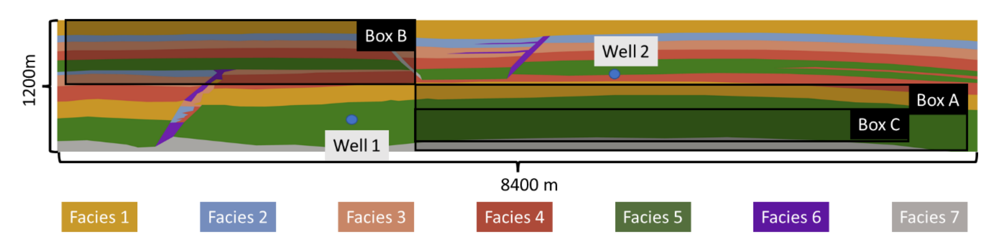
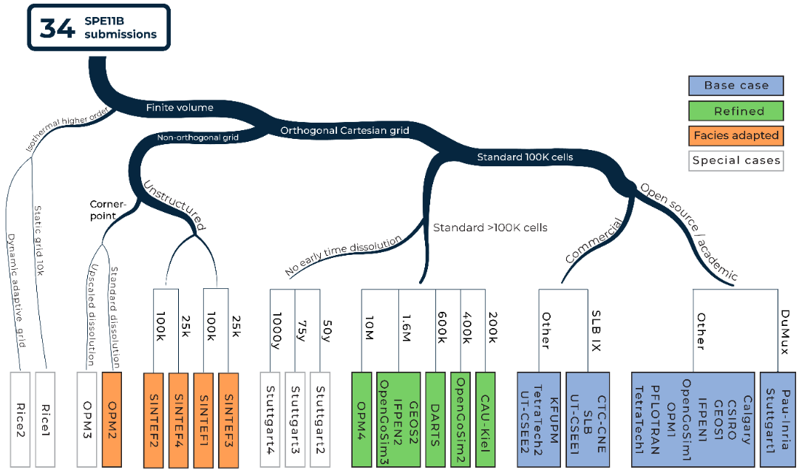
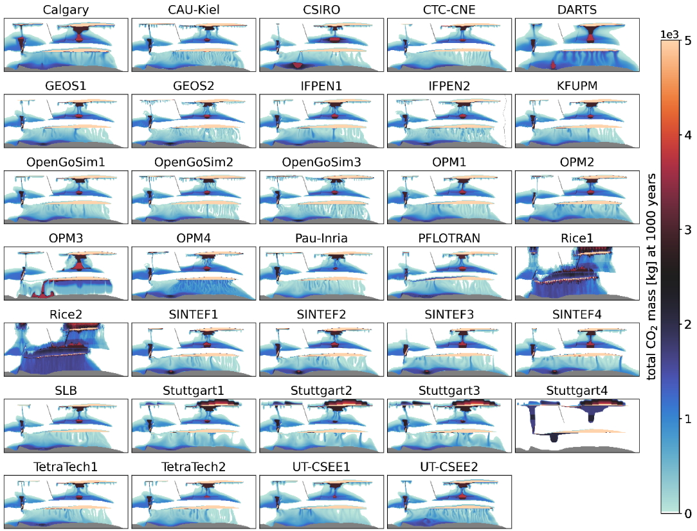

# SPE11B overview

This subcase is motivated by subsea geological CO2 storage and reflects conditions typical of the Norwegian Continental Shelf (Halland et al. 2013). A hypothetical two-dimensional transect is considered for this case. It is characterized by the following features.  

- **Domain and geometry**: The domain is 8.4 km wide and 1.2 km high, treated as a two-dimensional system with a nominal thickness of 1 m used for conversion to volumetric quantities. The well placement and pressure observation points are the same as for SPE11A, relative to the geometry.
- **Boundary conditions**: The boundary conditions include a buffer volume to emulate embedding the domain into a larger aquifer structure. The top and bottom boundaries are set to constant temperature, consistent with a geothermal gradient of 25°C/km and a reservoir depth of approximately 2 km.
- **Facies and permeability**: Facies properties are typical of a prime CO2 storage location, with a permeability of 1 D in the main reservoir (facies 5) and 0.1 mD in the seal (facies 1).
- **Initial conditions**: The simulation is initialized with pure water at hydrostatic pressure and geothermal gradient pressure, set 1000 y before injection begins.
- **Injection conditions**: The injection period lasts for 50 y, with a total simulation time of 1000 years. The injection rate is approximately 1100 tons of CO2 per year for each well.
- **Reporting schedule**: Sparse data are reported as 10 data points per year, while dense data are recorded every five years, both starting at the time of injection. The reporting grid for dense data is a 10 m by 10 m Cartesian grid, with a total of approximately 100,000 cells.

## Overview over results

### Final distribution of CO₂ mass for all results

