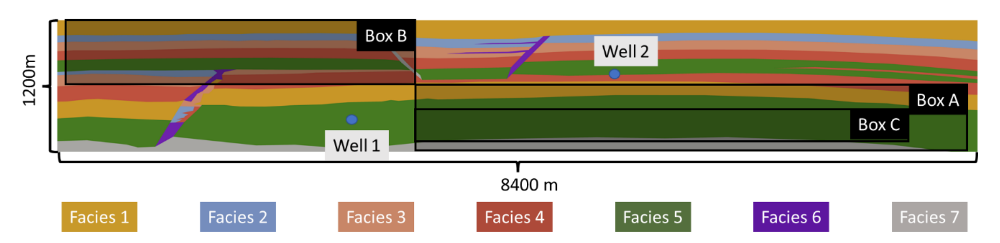

```@meta
EditURL = "../../../scripts/sparse_b.jl"
```

````@example sparse_b
using CSP11Visualizer, Gadfly # hide
results = CSP11Visualizer.parse_all_sparse(); # hide
nothing #hide
````



## Pressure in observation points

````@example sparse_b
set_default_plot_size(30cm, 20cm) # hide
function myplot(k; xlabel = "Time (years)", ylabel = "$k", title = "")
    Gadfly.with_theme(:dark) do
        Gadfly.plot(results, x=:time, y=k, Geom.line,
            color = :group,
            linestyle = :result,
            Guide.xlabel(xlabel),
            Guide.ylabel(ylabel),
            Guide.title(title)
        )
    end
end; # hide
nothing #hide
````

## Pressure observation points
### Pressure observation point 1
We can say something nice about this point.

````@example sparse_b
myplot(:P1, ylabel = "Pascal", title = "Pressure at P1") # hide
````

### Pressure observation point 2
We can say something nice about this point, too. We can also do some unrelated math to appear fancy:
The Brooks-Corey model is a simple model that can be used to generate relative
permeabilities. The model is defined in the mobile region as:

``k_{rw} = k_{max,w} \bar{S}_w``

``k_{ro} = k_{max,o} \bar{S}_o``

where $k_{max,w}$ is the maximum relative permeability, $\bar{S}_w$
is the normalized saturation for the water phase,

`` \bar{S}_w = \frac{S_w - S_{wi}}{1 - S_{wi} - S_{ro}}``

and, similarly, for the oil phase:

``\bar{S}_o = \frac{S_o - S_{ro}}{1 - S_{wi} - S_{ro}}``

````@example sparse_b
myplot(:P2, ylabel = "Pascal", title = "Pressure at P2") # hide
````

## Mobile CO₂

### Mobile CO₂ in region A

````@example sparse_b
myplot(:mobA, ylabel = "kg", title = "Mobile CO2 in region A") # hide
````

### Mobile CO₂ in region B

````@example sparse_b
myplot(:mobB, ylabel = "kg", title = "Mobile CO2 in region A") # hide
````

## Dissolved CO₂
### Dissolved CO₂ in region A

````@example sparse_b
myplot(:dissA) # hide
````

### Dissolved CO₂ in region B

````@example sparse_b
myplot(:dissB) # hide
````

## Immobile CO₂

### Immobile CO₂ in region A

````@example sparse_b
myplot(:immA) # hide
````

### Immobile CO₂ in region B

````@example sparse_b
myplot(:immB) # hide
````

## CO₂ in seal

### CO₂ in seal in region A

````@example sparse_b
myplot(:sealA) # hide
````

### CO₂ in seal in region B

````@example sparse_b
myplot(:sealB) # hide
````

## CO₂ in bound
### CO₂ in bound in total

````@example sparse_b
myplot(:boundTot) # hide
````

## CO₂ in seal

````@example sparse_b
myplot(:sealTot) # hide
````

---

*This page was generated using [Literate.jl](https://github.com/fredrikekre/Literate.jl).*

